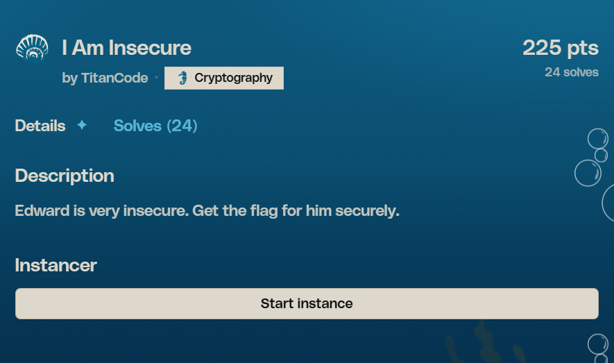
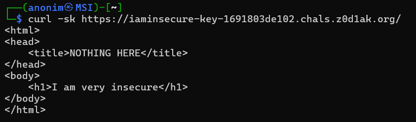
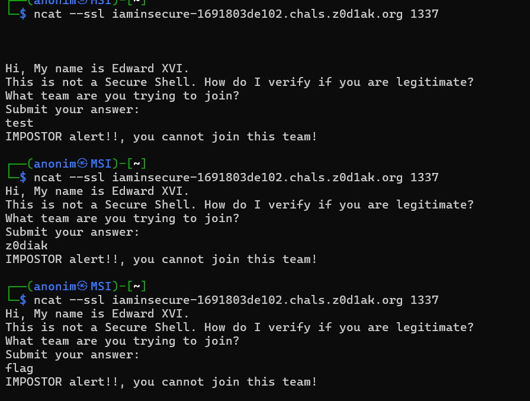
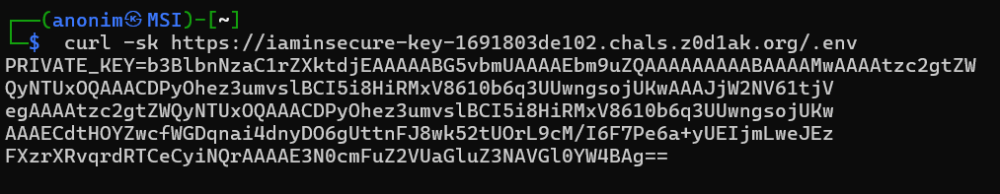
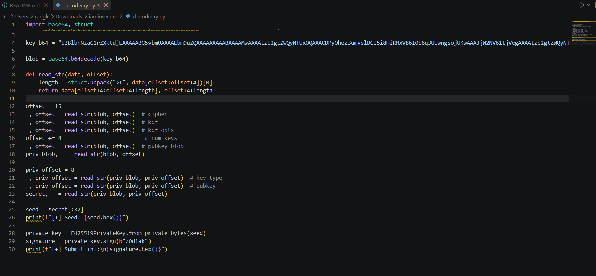
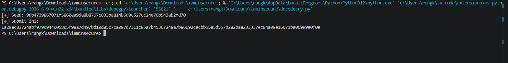
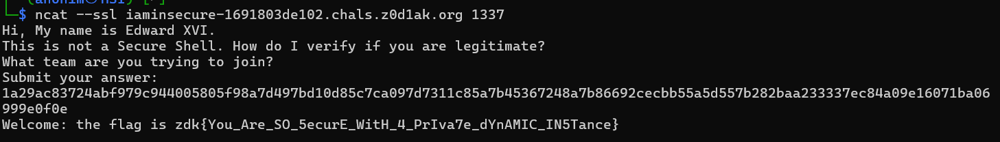

# z0d1ak CTF 2026 — I Am Insecure

**Solved by:** ftps3rver  
**Category:** Cryptography  
**Points:** 216  
**Solves:** 30  
**Author:** TitanCode



## 1. Executive Summary

This challenge provides two endpoints: a simple website and a TCP service that requires identity verification using cryptography. After performing directory fuzzing on the website, it was found that the `.env` file was exposed to the public and contained an Ed25519 private key in unencrypted OpenSSH format.

The vulnerability happens because the server doesn’t block access to sensitive configuration files. By extracting the seed from the leaked private key, an attacker can create a valid Ed25519 signature on behalf of the key owner. The flag is obtained by signing the string `z0d1ak` (the CTF team name) and sending the signature in hex format to the TCP service.

## 2. Challenge Description

> Edward is very insecure. Get the flag for him securely.

Flag format: `zdk{...}`

Endpoint given:

- Website: `https://iaminsecure-key-<HASH>.chals.z0d1ak.org`
- Service: `ncat --ssl iaminsecure-<HASH>.chals.z0d1ak.org 1337`

## 3. Initial Reconnaissance

### 3.1 Service TCP

First connect to the service and see what is the respond:

```bash
ncat --ssl iaminsecure-1691803de102.chals.z0d1ak.org 1337
```

Response:

```text
Hi, My name is Edward XVI.
This is not a Secure Shell. How do I verify if you are legitimate?
What team are you trying to join?
Submit your answer:
```

Observasi penting:

- **"Edward XVI"** — hint to algoritma **Ed25519** (EdDSA signature scheme berbasis Curve25519)
- **"not a Secure Shell"** — hint to format SSH key
- **"verify if you are legitimate"** — server verified something (signature?)
- Service is **one-shot**: receive one input, validate, dan giving response

Testing input random (`test`, `z0d1ak`, `flag`) always get:

```text
IMPOSTOR alert!!, you cannot join this team!
```

### 3.2 Website

```bash
curl -sk https://iaminsecure-key-1691803de102.chals.z0d1ak.org/
```



## 4. Attack Surface / Important Observations

1. The name "Edward XVI" refers to Ed25519 — a digital signature algorithm.
2. Ed25519 signatures are deterministic — same input = same output (no random nonce).
3. The service doesn’t provide a per-connection challenge/nonce — meaning the correct answer is static.
4. The website is very minimalistic — likely there are hidden files that aren’t indexed.
5. The subdomain contains the word `key` (`iaminsecure-key-...`) — a hint that the website stores a key.

### Hypothesis

The server verifies Ed25519 signatures. The private key is leaked somewhere on the website. We need to find that key and create a valid signature.

## 5. Failed Attempts

### Attempt 1 — Submit plain text answers



Trying string as a direct response:

```text
z0d1ak -> IMPOSTOR
test   -> IMPOSTOR
flag   -> IMPOSTOR
```

**Conclusion:** The answer isn’t plain text. The server expects a specific cryptographic format.

## 6. Vulnerability Discovery

### Expected Behavior

`.env` file should:

- Not be accessible from the web (blocked by web server configuration)
- Or not be in a served directory

### Actual Behavior

```bash
curl -sk https://iaminsecure-key-1691803de102.chals.z0d1ak.org/.env
```



### Root Cause

The web server (`Python http.server`) serves all files in the directory, including the `.env` file. There's no configuration to block access to sensitive files. The private key is stored without encryption (`cipher: none`, `kdf: none`), so anyone who gets this file immediately has full access to the key material.

## 7. Exploitation

### Step 1: Decode base64 dan parse format OpenSSH



That Base64 decodes to the `openssh-key-v1` format:

```text
Magic: openssh-key-v1\0
Cipher: none (not encrypted)
KDF: none
Key type: ssh-ed25519
Comment: strangeThings@Titan
Seed: 9db4739867071f5860ea9da8b8767c833ba814b6d9c527cc24e76b543ab2fd70
```

### Step 2: Reconstruct Ed25519 private key dari seed

```python
from cryptography.hazmat.primitives.asymmetric.ed25519 import Ed25519PrivateKey

seed = bytes.fromhex(
    "9db4739867071f5860ea9da8b8767c833ba814b6d9c527cc24e76b543ab2fd70"
)
private_key = Ed25519PrivateKey.from_private_bytes(seed)
```

### Step 3: Sign team name `z0d1ak`



```python
signature = private_key.sign(b"z0d1ak")
answer = signature.hex()
```

### Step 4: Submit ke service



Submit your answer:

```text
1a29ac83724abf979c944005805f98a7d497bd10d85c7ca097d7311c85a7b45367248a7b86692cecbb55a5d557b282baa233337ec84a09e16071ba06999e0f0e
```

Response:

```text
Welcome: the flag is zdk{You_Are_SO_5ecurE_WitH_4_PrIva7e_dYnAMIC_IN5Tance}
```

### Why this works

The server stores the corresponding public key. When it receives a response, the server:

1. Interprets the input as a hex-encoded Ed25519 signature.
2. Verifies the signature against the message `z0d1ak` using the stored public key.
3. If the signature is valid, the user proves ownership of the private key and receives the flag.

Since we have the leaked private key, we can create a valid signature.

## 8. Root Cause Analysis

The vulnerability isn't in the weakness of the Ed25519 algorithm (which is a state-of-the-art signature scheme). The real root cause is information disclosure:

1. The `.env` file contains the private key without encryption.
2. The web server doesn't block access to dot-files.
3. The private key isn't protected with a passphrase.

Even if the file is moved to another location, the vulnerability still exists as long as:

- The private key is stored without encryption.
- There's no access control on the file.
- The key isn't rotated after a compromise.

## 9. Flag

```text
zdk{You_Are_SO_5ecurE_WitH_4_PrIva7e_dYnAMIC_IN5Tance}
```

## 10. Attack Chain

```text
Directory Fuzzing pada Website
        |
        v
Menemukan /.env (Information Disclosure)
        |
        v
Extract base64-encoded OpenSSH private key
        |
        v
Parse openssh-key-v1 format, extract 32-byte seed
        |
        v
Reconstruct Ed25519 private key
        |
        v
Sign team name "z0d1ak" (deterministic signature)
        |
        v
Submit hex-encoded signature ke TCP service
        |
        v
Server verifies signature -> Flag
```

## 11. Why The Exploit Works

The server verifies Ed25519 signatures using a public key that's stored internally. Because:

1. The private key leaked through an unprotected `.env` file.
2. The private key isn’t encrypted (`cipher=none`) so it’s immediately usable.
3. Ed25519 signatures are deterministic — no timing or session-specific data needed.
4. The server verifies the signature on a fixed message (`z0d1ak`) — there’s no changing challenge-response.

Anyone who has the private key can create a valid signature anytime.

## 12. How To Fix It

### Vulnerable Implementation

```python
# The web server serves all files including .env
http.server.SimpleHTTPServer(directory="/app")
```

### Fix

1. Block access to dot-files at web server config.

```nginx
location ~ /\. {
    deny all;
    return 404;
}
```

2. Encrypt private key with passphrase.

```bash
ssh-keygen -t ed25519 -f id_ed25519
# Selalu set passphrase!
```

3. Use environment variables, not `.env` file at served directory.

```bash
export PRIVATE_KEY="..."
```

4. If you have to use `.env`, put it outside the webroot.

```text
/opt/secrets/.env  # not at /var/www/html/.env
```

### Defense-in-depth

- Never store private keys without encryption.
- Always block access to dot files (`.env`, `.git`, `.htaccess`).
- Use secret management tools (Vault, AWS Secrets Manager).
- Implement a challenge-response protocol, not static verification.
- Rotate keys regularly.

## 13. Key Takeaways

1. **The `.env` file is one of the main targets for attackers — always make sure it’s not exposed via the web.**
2. **A private key without a passphrase = plaintext credentials — anyone who reads the file has full access.**
3. **Naming hints in CTF are important — “Edward XVI” directly refers to Ed25519. Deterministic signatures tanpa challenge-response = replayable** — leaked key = permanent compromise.
4. **Directory fuzzing adalah reconnaissance standard** — always check common files (`.env`, `.git/`, `robots.txt`).

## 14. Reproduction Steps

### 1. Clone solver

```powershell
cd C:\Users\rangk\Downloads\iaminsecure
```

### 2. Install dependency

```bash
pip install cryptography
```

### 3. Edit `INSTANCE_HASH` di `decodecry.py` sesuai instance kamu

### 4. Run `decodecry.py`

```python
import base64
import struct

from cryptography.hazmat.primitives.asymmetric.ed25519 import Ed25519PrivateKey

key_b64 = "b3BlbnNzaC1rZXktdjEAAAAABG5vbmUAAAAEbm9uZQAAAAAAAAABAAAAMwAAAAtzc2gtZWQyNTUxOQAAACDPyOhez3umvslBCI5i8HiRMxV8610b6q3UUwngsojUKwAAAJjW2NV61tjVegAAAAtzc2gtZWQyNTUxOQAAACDPyOhez3umvslBCI5i8HiRMxV8610b6q3UUwngsojUKwAAAECdtHOYZwcfWGDqnai4dnyDO6gUttnFJ8wk52tUOrL9cM/I6F7Pe6a+yUEIjmLweJEzFXzrXRvqrdRTCeCyiNQrAAAAE3N0cmFuZ2VUaGluZ3NAVGl0YW4BAg=="

blob = base64.b64decode(key_b64)


def read_str(data, offset):
    length = struct.unpack(">I", data[offset:offset + 4])[0]
    return data[offset + 4:offset + 4 + length], offset + 4 + length


offset = 15
_, offset = read_str(blob, offset)  # cipher
_, offset = read_str(blob, offset)  # kdf
_, offset = read_str(blob, offset)  # kdf_opts
offset += 4                        # num_keys
_, offset = read_str(blob, offset)  # pubkey blob
priv_blob, _ = read_str(blob, offset)

priv_offset = 8
_, priv_offset = read_str(priv_blob, priv_offset)  # key_type
_, priv_offset = read_str(priv_blob, priv_offset)  # pubkey
secret, _ = read_str(priv_blob, priv_offset)

seed = secret[:32]
print(f"[+] Seed: {seed.hex()}")

private_key = Ed25519PrivateKey.from_private_bytes(seed)
signature = private_key.sign(b"z0d1ak")
print(f"[+] Submit ini:\n{signature.hex()}")
```

### Dependencies

- Python 3.10+
- `cryptography` library (`pip install cryptography`)

## 15. Timeline

```text
00:00 Read challenge, connect ke service, observasi banner "Edward XVI"
00:05 Identifikasi hint Ed25519, test input plain text -> semua IMPOSTOR
00:15 Directory fuzzing pada website -> ditemukan /.env
00:18 Extract dan parse OpenSSH private key
00:22 Sign "z0d1ak" dengan leaked key, submit hex signature
00:23 Flag obtained
```
